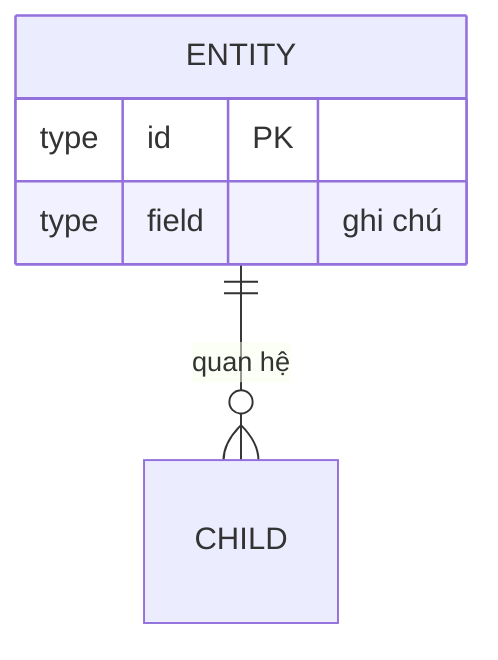

# Repository & ERD delta: <tên yêu cầu>

> ERD tổng thể nằm ở project-knowledge/data-model.md (cập nhật ở đó).
> File này mô tả phần ERD THAY ĐỔI cho yêu cầu này + interface repository cần.

## ERD delta (Mermaid)

## Repository interfaces
### <Tên>Repository
| Method | Loại | Tham số | Trả về | Mô tả |
|---|---|---|---|---|
| findById | read | id | Entity? | <...> |
| findBy<X> | read | <...> | Entity[] | <...> |
| save | write | Entity | Entity | tạo/cập nhật |
| delete | write | id | void | <...> |

## Ràng buộc & index
- <unique / FK / index cần cho truy vấn ở trên>

## Mapping endpoint → repository method
| Endpoint (contract) | Method repository dùng |
|---|---|
| <METHOD path> | <Repo.method> |
