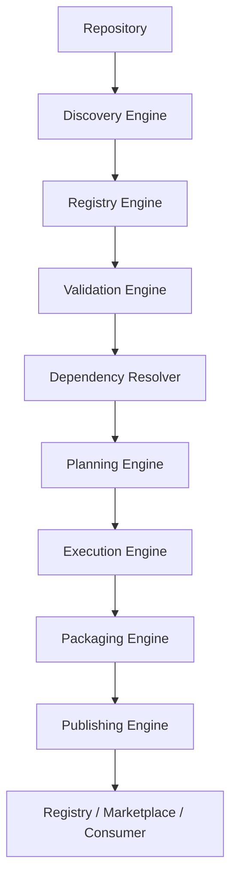
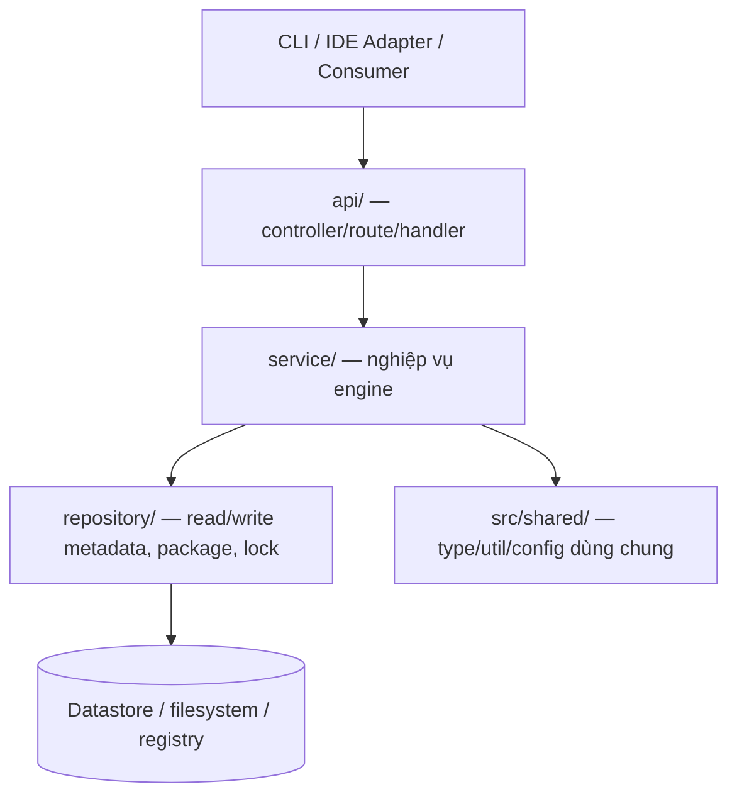

# Architecture

> Tổng hợp từ RFC-0003 (Layered Architecture), RFC-0200 (Runtime Architecture) và runtime flow
> trong RFC-0000 §7 / docs/diagrams/runtime-flow.mmd. Nguồn sự thật: các RFC tương ứng.
>
> LƯU Ý 2 lớp khác nhau:
> - **Tầng nền tảng ARPS** (đặc tả sản phẩm) = các runtime engine xử lý resource.
> - **Phân tầng mã nguồn backend** (quy ước repo) = api → service → repository, áp cho code hiện thực.

## Tầng nền tảng ARPS (RFC-0003)
Specification · Metadata · Resource · Runtime · Adapter · Distribution · Governance.

## Runtime engines & ranh giới (RFC-0200)
Discovery · Registry · Validation · Dependency (Resolver) · Planning · Execution · Packaging · Publishing.

## Runtime flow (RFC-0000 §7, docs/diagrams/runtime-flow.mmd)

## Trách nhiệm từng engine
- **Discovery (RFC-0201):** khám phá resource từ filesystem / package / registry.
- **Registry (RFC-0202):** lưu metadata đã khám phá; lookup theo id/kind/version/label/checksum.
- **Validation (RFC-0203, RFC-0106):** validate resource + registry (syntax→schema→metadata→semantic→compat→policy).
- **Dependency Resolver (RFC-0204):** resolve phụ thuộc, chọn version, xử lý xung đột, sinh lock (RFC-0401).
- **Planning (RFC-0205):** resolved graph → execution plan deterministic (tối ưu cache + parallel an toàn).
- **Execution (RFC-0206):** thực thi plan, KHÔNG tự resolve.
- **Packaging (RFC-0107, RFC-0402):** sinh package bất biến (nén/ký/verify).
- **Publishing / Distribution (RFC-0403):** Registry lưu package+metadata; Marketplace index/search/present.

## Phân tầng mã nguồn backend (quy ước repo — ADR-0001)

Tầng trên gọi tầng dưới, KHÔNG gọi ngược. Mỗi runtime engine khi hiện thực = một module trong `src/`.

## Quyết định kiến trúc chính
- ADR-0001: root mã nguồn + quy ước module + phân tầng backend — docs/decisions/0001-vi-du-quyet-dinh.md
- ADR-0002: code convention — docs/decisions/0002-code-convention.md
- Đặc tả nền tảng đầy đủ: docs/ (SUMMARY.md là mục lục RFC).

## Tích hợp ngoài
- Registry / Marketplace phân phối package (RFC-0403).
- IDE / AI assistant qua Adapter (RFC-0700, RFC-0701) — biến canonical resource → output đích.
- Ký & toàn vẹn package (RFC-0801); trust/secrets (RFC-0800).
