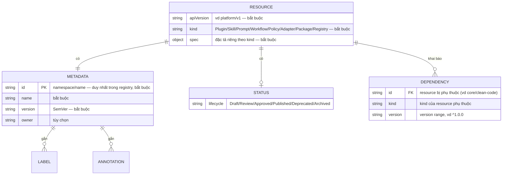

# Data Model / ERD

> Mô hình dưới đây phản ánh **canonical resource model** thực tế trong
> `schemas/resource.schema.json` + RFC-0100/0102/0103/0104/0105.
> Nguồn sự thật về schema: `schemas/resource.schema.json` (JSON Schema draft 2020-12) > file này.
> LƯU Ý: ARPS hiện là đặc tả + xử lý resource (file YAML/JSON); chưa chốt datastore persistence
> (Non-Goal RFC-0000 §4). ERD này là MÔ HÌNH LOGIC của resource, không phải DDL của một DB cụ thể.

## ERD (mô hình logic)

## Giải thích thực thể
- **RESOURCE**: đơn vị cốt lõi. Bắt buộc `apiVersion`, `kind`, `metadata`, `spec` (schema).
- **METADATA**: định danh + version + owner + labels/annotations (RFC-0102). `id` duy nhất trong registry.
- **STATUS.lifecycle**: vòng đời `Draft→Review→Approved→Published→Deprecated→Archived` (RFC-0103).
- **DEPENDENCY**: cạnh trong dependency graph; tham chiếu resource khác qua `id/kind/version`
  (xem `examples/plugins/backend-plugin.yaml`).

## Quy tắc quan hệ & ràng buộc
- `metadata.id` **duy nhất** trong một registry (RFC-0000 §8).
- `version` theo **SemVer** (RFC-0005); breaking ⇒ major mới (RFC-0007).
- Đồ thị phụ thuộc **acyclic** — DAG, không chu trình (RFC-0104).
- `additionalProperties: false` ở cấp resource (chỉ cho phép apiVersion/kind/metadata/spec/status);
  `metadata` cho phép thuộc tính mở rộng (`additionalProperties: true`) — xem schema.

## Ví dụ thực (examples/)
- `examples/resources/skill.yaml` — Skill `core/clean-code`, lifecycle Published.
- `examples/plugins/backend-plugin.yaml` — Plugin `plugins/backend` phụ thuộc `core/clean-code` (^1.0.0).
- `examples/workflows/build-workflow.yaml` — Workflow `build`: discover→validate→resolve→plan→execute→package.
